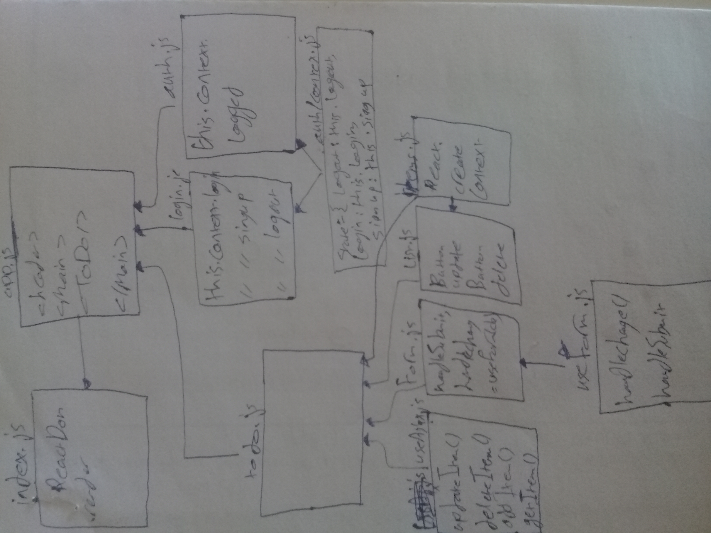

# todo-react

**In this final phase, we’ll be requiring that users be logged in, in order to see the to do items. Additionally, based on their user type, they will be allowed (or denied) to perform actions such as editing or deleting them.**

#### To Do List Manager Phase 4: Adding security and access controls to the application.
### after log in

## Author: Hammad Al

### How to initialize/run your application
* npm run start

### UML

