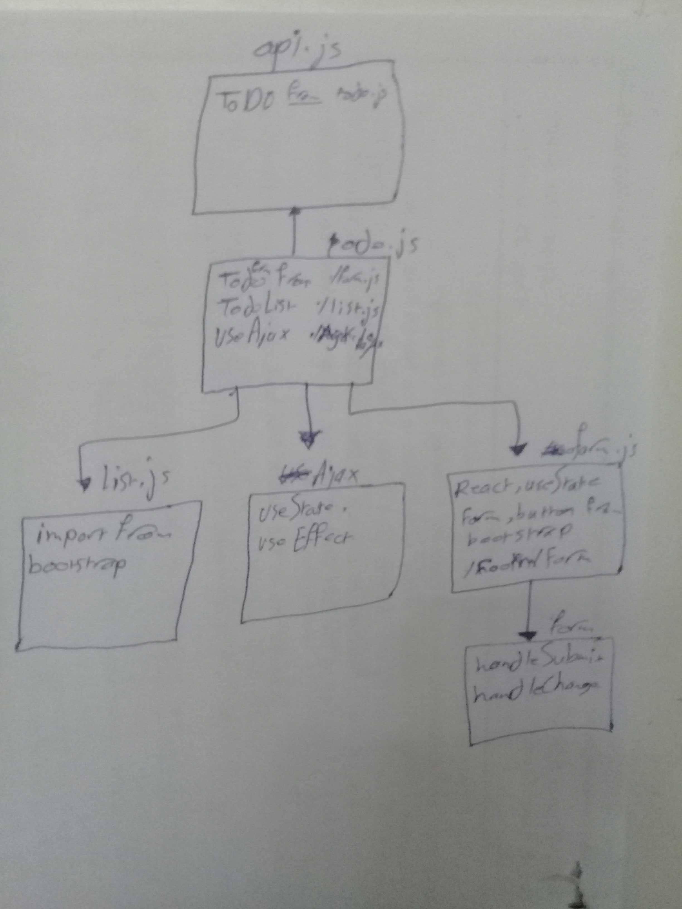

# todo-react

**In this phase, we’ll be connecting our application to an API so that our list will be saved permanently. This will require a working and deployed API server with a proper “To Do” data model and appropriate REST routes**

#### To Do List Manager Phase 2: Connecting the To Do Application to an external API and Database

## Author: Hammad Al

### How to initialize/run your application
* npm run start

### UML
