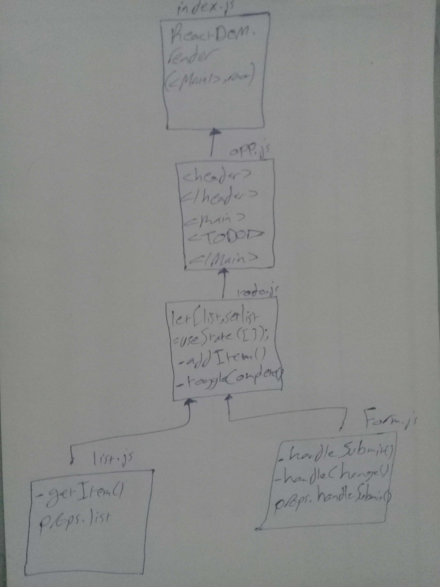

# todo-react

**In this initial phase, we’re going to have to start by converting a legacy application into a more modern architecture. Our initial “Proof of Concept” was written using class based components and was not properly styled. Now that our client has given us the “green light” for development, we’re going to refactor the application using Hooks and upgrading the style.**

#### To Do List Manager Phase 1: Begin the build of an application designed for creating and organizing a “To Do” list in your browser.

## Author: Hammad Al

### How to initialize/run your application
* npm run start

### UML
